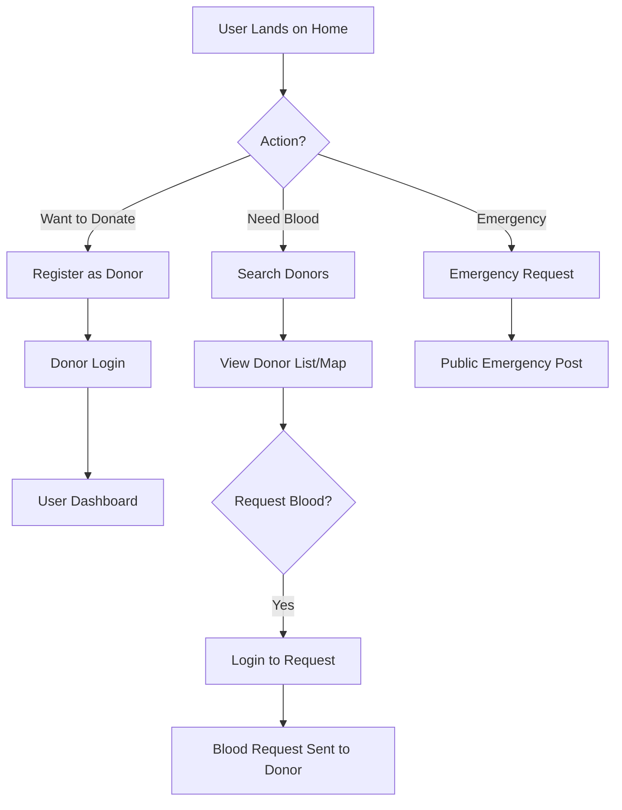

# 🩸 BloodConnect: A Geo-Based Platform

BloodConnect is a modern web application designed to bridge the gap between blood donors and those in urgent need of blood. By using geolocation and real-time data, the platform ensures that help is just a click away.

## 🚀 How it Works

The platform operates as a centralized hub where donors register their availability and location. Patients can then search for donors based on blood group and proximity.

### 🔄 Project Workflow

---

## 🔑 Key Workflows

### 1. Registration & Login Workflow
*   **Donor Registration**: New users can sign up by providing their blood group, location (city), and contact details.
*   **Dual Authentication**: 
    *   **Donor Login**: Allows individual donors to manage their profiles and availability.
    *   **Admin Login**: Provides a high-level overview of system statistics and donor management.

### 2. Blood "Booking" (Request) Workflow
Finding a donor is streamlined through multiple discovery methods:
1.  **Search**: Filter donors by blood group and city.
2.  **Nearby Search**: Uses browser geolocation to find the closest donors in real-time.
3.  **Map View**: A visual map showing clusters of available donors nearby.
4.  **The Request (Booking)**:
    *   Once a donor is found, the user clicks **"Request"**.
    *   The system verifies the requester is logged in.
    *   A notification/request is logged in the system for the donor.
    *   Users can also click **"Call"** for immediate direct contact.

### 3. Emergency Request Workflow
In critical situations, users can skip the search and post a global **Emergency Request**. This broadcasts the need to all users visiting the platform, ensuring maximum visibility for life-saving situations.

---

## 🛠️ Technology Stack

-   **Frontend**: React.js with Glassmorphism UI (CSS).
-   **Backend**: Node.js & Express.
-   **Database**: MongoDB Atlas (Cloud Database).
-   **Maps**: Leaflet/OpenStreetMap.
-   **Environment**: Secure configuration using `.env` for database credentials.

---

## 💻 Setup and Installation

### Prerequisites
- Node.js installed.
- MongoDB Atlas account (configured in `.env`).

### Backend Setup
1. Navigate to the backend folder: `cd "plan 2/backend"`
2. Install dependencies: `npm install`
3. Start the server: `npm start` (Runs on port 5000)

### Frontend Setup
1. Navigate to the frontend folder: `cd "plan 2/frontend"`
2. Install dependencies: `npm install`
3. Start the app: `npm start` (Runs on port 3000)

---

## 📂 Project Structure
-   `/backend`: API routes, Mongoose models, and server logic.
-   `/frontend`: React components, custom CSS, and state management.
-   `migrateData.js`: Utility script to migrate local data to the cloud.

---
*Created for the BloodConnect implementation project.*

